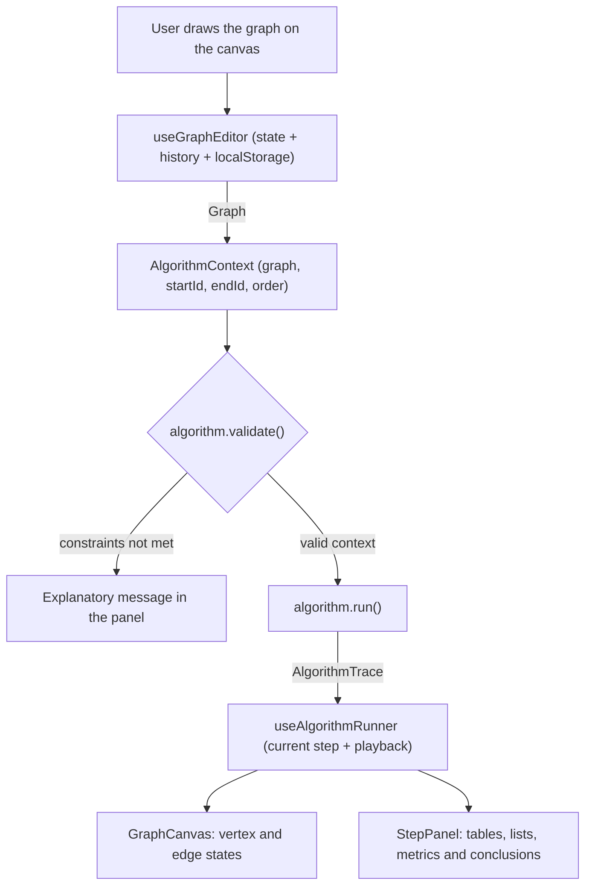

# Graph Labs

<div align="center">
  <a href="https://www.graphlabs.arturbomtempo.dev/">
    
  </a>
</div>

<div align="justify">
  <b>Graph Labs</b> is a visual <b>graph theory</b> laboratory: you draw the graph directly on the canvas, pick one of the <b>17 classic algorithms</b> implemented, and follow the execution <i>step by step</i>, with the same <i>tables</i>, <i>queues</i> and <i>notation</i> used in the classroom. Every iteration comes with the reasoning behind the decision that was made, turning static pseudocode on paper into something you can inspect, pause and replay at whatever speed you want. The project was born in the graph theory teaching assistantship at PUC Minas to solve a recurring difficulty in office hours: understanding what actually happens at each step of an algorithm. In practice, you can rebuild the graph from a homework exercise, run the method on it, and check every step against what you solved by hand. Everything runs in the browser, with no back-end, no database and no sign-up.
</div>

> [!NOTE]
> The application interface is written in **Brazilian Portuguese**, since it was built as classroom support material. This documentation is in English, and the algorithms, notation and structures are language independent.

---

## 🚧 Project Status


[](https://www.graphlabs.arturbomtempo.dev/)


[](LICENSE.md)

---

## 📚 Table of Contents

- [Graph Labs](#graph-labs)
    - [Project Status](#-project-status)
    - [Table of Contents](#-table-of-contents)
    - [Useful Links](#-useful-links)
    - [About the Project](#-about-the-project)
    - [Key Features](#-key-features)
    - [Implemented Algorithms](#-implemented-algorithms)
    - [Sample Graphs](#-sample-graphs)
    - [Tech Stack](#-tech-stack)
        - [Application](#application)
        - [Development Tooling](#development-tooling)
    - [Architecture](#-architecture)
        - [Layer Overview](#layer-overview)
        - [Algorithm Execution Flow](#algorithm-execution-flow)
        - [The Algorithm Contract](#the-algorithm-contract)
        - [Architectural Decisions](#architectural-decisions)
    - [Installation and Setup](#-installation-and-setup)
        - [Prerequisites](#prerequisites)
        - [Installation](#installation)
        - [Running in Development](#running-in-development)
        - [Available Scripts](#available-scripts)
        - [Environment Variables](#environment-variables)
    - [Deployment](#-deployment)
    - [Project Structure](#-project-structure)
    - [Demo](#-demo)
        - [Screenshots](#screenshots)
        - [Application Pages](#application-pages)
        - [How to Use the Studio](#how-to-use-the-studio)
        - [Keyboard Shortcuts](#keyboard-shortcuts)
    - [Verification and Quality](#-verification-and-quality)
    - [References](#-references)
    - [Authors](#-authors)
    - [Contributing](#-contributing)
    - [Acknowledgments](#-acknowledgments)
    - [License](#-license)

---

## 🔗 Useful Links

- 🌐 **Live Application:** [www.graphlabs.arturbomtempo.dev](https://www.graphlabs.arturbomtempo.dev/)
    > 💻 **Description:** Production version, hosted on Vercel. No installation and no sign-up required.
- 🧪 **Studio:** [Build a graph and run an algorithm](https://www.graphlabs.arturbomtempo.dev/estudio)
    > ✏️ **Description:** Graph editor with step by step execution, tracking tables and final conclusions.
- 📖 **Pseudocode:** [Algorithm documentation](https://www.graphlabs.arturbomtempo.dev/algoritmos)
    > 📚 **Description:** Core idea, pseudocode, maintained invariant and common pitfalls for each method.
- 💾 **Repository:** [github.com/arturbomtempo-dev/graph-labs](https://github.com/arturbomtempo-dev/graph-labs)
    > 🧩 **Description:** Full source code of the project.

---

## 📝 About the Project

**Graph Labs** exists because pseudocode on paper hides exactly the part that matters most for learning: **what happens at each iteration**. Reading that Dijkstra's algorithm "selects the unclosed vertex with the smallest label" is very different from watching that vertex get selected, the label table get updated, and the edge enter the solution.

**The problem it solves:** during graph theory office hours, the question was almost never about the statement of the algorithm, but about running it on a concrete graph. Redoing that on a whiteboard is slow and does not scale. Graph Labs automates that work: students build the graph from their own exercise and the algorithm runs on it, showing each step along with the reasoning behind the decision.

**The context:** the project was developed for the **graph theory** teaching assistantship in the **Software Engineering** program at **PUC Minas**, as support material for lectures and office hours.

**Where it can be used:**

- In lectures and tutoring sessions, to demonstrate an algorithm live on a graph drawn on the spot.
- When checking homework, by rebuilding the graph from the problem statement and comparing each step against a hand written solution.
- For individual study, to review the notation, tables and invariants of each algorithm before an exam.
- As an implementation reference, since every algorithm lives in a pure TypeScript module that is readable and free of any UI dependency.

What makes the project relevant is its fidelity to the course: the notation, algorithm names, tables and visiting order follow what is actually taught and tested, rather than a generic library version.

---

## ✨ Key Features

- 🖊️ **Canvas graph editor:** add vertices, connect pairs, drag to reposition and delete elements using dedicated tools (select, add, connect and erase).
- 🔀 **Directed and undirected edges:** set the default orientation for new edges and flip the direction of any existing one.
- ⚖️ **Optional weights:** assign weights to edges when the algorithm requires them, or work with simple unweighted graphs.
- 🧮 **17 classic algorithms:** traversal, connectivity, Eulerian graphs, minimum spanning tree, shortest path, maximum flow, topological sorting, matching and coloring.
- ⏯️ **Step by step execution:** move forward one step at a time, go back, jump to the first or last step, or play automatically at 0.5×, 1×, 2× and 4× speed.
- 📊 **Classroom faithful tracking:** each step shows the label tables, the auxiliary queues, stacks and sets, plus metrics describing the current state.
- 🎯 **Reasoning for every iteration:** each step is described in text, explaining why that vertex or edge was chosen.
- ✅ **Final conclusions:** once the run finishes, the algorithm presents its consolidated result (spanning tree, path cost, flow value, topological order, number of colors, and so on).
- 🧩 **12 sample graphs:** ready made models covering every area of the course, including a Welsh-Powell counterexample.
- 🚦 **Per algorithm validation:** before running, the app checks the algorithm constraints (directed graph, non negative weights, defined source and sink) and explains what needs to be fixed.
- 📖 **Pseudocode page:** core idea, annotated pseudocode, maintained invariant and common pitfalls for each method, filterable by category.
- ↩️ **Undo and redo:** up to 60 graph states in history, with keyboard shortcuts.
- 🧭 **Automatic layout:** repositions vertices to keep the drawing readable as the graph grows.
- 💾 **Local persistence:** the graph, the layout preference and the theme are stored in the browser and are still there when you reopen the page.
- 🌗 **Light and dark themes:** follows the system preference and allows manual switching.
- 📱 **Responsive layout:** works on desktop screens and mobile devices.

---

## 🧮 Implemented Algorithms

Every algorithm below produces a full step by step execution. Complexity follows the notation used in the course, with `n` vertices and `m` edges.

| Category              | Algorithm                   | Complexity                         |
| :-------------------- | :-------------------------- | :--------------------------------- |
| Graph traversal       | Depth-First Search (DFS)    | `O(n + m)`                         |
| Graph traversal       | Breadth-First Search (BFS)  | `O(n + m)`                         |
| Connectivity          | Kosaraju's algorithm        | `O(n + m)`                         |
| Eulerian graphs       | Fleury's algorithm          | `O(m²)`                            |
| Minimum spanning tree | Prim's algorithm            | `O(m log n)`                       |
| Minimum spanning tree | Kruskal's algorithm         | `O(m log m)`                       |
| Shortest path         | Dijkstra's algorithm        | `O(n²)`                            |
| Shortest path         | Bellman-Ford algorithm      | `O(n · m)`                         |
| Shortest path         | Floyd-Warshall algorithm    | `O(n³)`                            |
| Maximum flow          | Ford-Fulkerson algorithm    | `O(m · f)` with integer capacities |
| Maximum flow          | Edmonds-Karp algorithm      | `O(n · m²)`                        |
| Maximum flow          | Dinic's algorithm           | `O(n² · m)`                        |
| Topological sorting   | Kahn's algorithm            | `O(n + m)`                         |
| Topological sorting   | Topological sorting via DFS | `O(n + m)`                         |
| Matching              | Edmonds' blossom algorithm  | `O(n² · m)`                        |
| Coloring              | Greedy coloring             | `O(n + m)`                         |
| Coloring              | Welsh-Powell algorithm      | `O(n²)`                            |

---

## 🧩 Sample Graphs

Ready made models available in the studio, designed to cover the characteristic cases of each area of the course:

| Model                       | What it is for                                                       |
| :-------------------------- | :------------------------------------------------------------------- |
| Weighted network            | Baseline for minimum spanning tree (Prim and Kruskal) and Dijkstra.  |
| Simple graph                | Unweighted graph, ideal for DFS and BFS.                             |
| Directed graph with cycles  | Strongly connected components, for Kosaraju.                         |
| Negative weights            | A scenario where Dijkstra fails and Bellman-Ford is required.        |
| Flow network                | Source, sink and capacities, for the maximum flow algorithms.        |
| Bottleneck network          | Highlights the minimum cut that limits the flow.                     |
| Eulerian graph              | Contains an Eulerian circuit, for Fleury.                            |
| Semi-Eulerian graph         | Contains an Eulerian trail but no circuit.                           |
| Activity precedence         | Directed acyclic graph, for topological sorting.                     |
| Matching with buttons       | A maximum matching scenario, for Edmonds' algorithm.                 |
| Vertex coloring             | Baseline for greedy coloring and Welsh-Powell.                       |
| Welsh-Powell counterexample | Shows that the heuristic does not always reach the chromatic number. |

---

## 🛠 Tech Stack

The versions below are the ones used in the project. Keeping these versions (or compatible newer ones) is recommended to guarantee everything works.

### Application

| Layer             | Technology                                                                                             |
| :---------------- | :----------------------------------------------------------------------------------------------------- |
| UI library        | [React](https://react.dev/) 19.2                                                                       |
| Language          | [TypeScript](https://www.typescriptlang.org/) 6.0                                                      |
| Build tool        | [Vite](https://vite.dev/) 8.2                                                                          |
| Styling           | [Tailwind CSS](https://tailwindcss.com/) 4.3                                                           |
| Routing           | [React Router](https://reactrouter.com/) 7.18                                                          |
| Icons             | [Lucide React](https://lucide.dev/) 1.37                                                               |
| Class composition | [clsx](https://github.com/lukeed/clsx) and [tailwind-merge](https://github.com/dcastil/tailwind-merge) |
| Graph rendering   | Native SVG, with no visualization library                                                              |
| State management  | React hooks (`useState`, `useMemo`, `useCallback`) plus custom hooks                                   |
| Persistence       | Browser `localStorage`                                                                                 |

> [!NOTE]
> Graph Labs is an **entirely client-side** application. There is no back-end, database, authentication or external API call: every algorithm runs in the user's browser.

### Development Tooling

| Tool                                                         | Purpose                                                           |
| :----------------------------------------------------------- | :---------------------------------------------------------------- |
| [ESLint](https://eslint.org/) 10                             | Static analysis, with `typescript-eslint` and React Hooks rules.  |
| [Prettier](https://prettier.io/) 3                           | Automatic formatting (4 spaces, single quotes, 100 column width). |
| [Vercel](https://vercel.com/)                                | Hosting and continuous deployment.                                |
| [Conventional Commits](https://www.conventionalcommits.org/) | Commit message convention.                                        |

---

## 🏗 Architecture

Graph Labs is a **single page application** organized into two clearly separated parts: a **pure domain core**, written in plain TypeScript, and a **presentation layer** in React that consumes it. This separation was chosen because the graph algorithms are the most important and most sensitive part of the project: keeping them free of React makes every method readable, testable and verifiable line by line against the course pseudocode.

### Layer Overview

| Layer             | Location                         | Responsibility                                                                                 |
| :---------------- | :------------------------------- | :--------------------------------------------------------------------------------------------- |
| Domain            | `src/lib/graph`                  | Graph types, vertex and edge creation and lookup, layout, sample graphs and step construction. |
| Algorithms        | `src/lib/algorithms`             | One pure module per algorithm, plus the central registry and the teaching documentation.       |
| Application state | `src/hooks`                      | Graph editing with history, execution control and theme.                                       |
| Presentation      | `src/pages` and `src/components` | Pages, SVG canvas, panels and the reusable component design system.                            |
| Routing           | `src/routes.tsx`                 | Maps the four application routes onto the `AppShell`.                                          |

### Algorithm Execution Flow



The key idea in this design is that **the UI is a pure function of the current step**. No component recomputes the algorithm: the method runs exactly once, produces the complete list of steps, and the interface simply navigates through it. That makes playback, rewinding and jumping between steps trivial and always consistent.

### The Algorithm Contract

Every algorithm implements the same interface, defined in [types.ts](src/lib/graph/types.ts):

```ts
interface AlgorithmDefinition {
    id: string;
    name: string;
    shortName: string;
    category: AlgorithmCategory;
    tagline: string;
    complexity: string;
    needsStart: boolean;
    needsEnd: boolean;
    constraints: string[];
    validate: (context: AlgorithmContext) => string[];
    run: (context: AlgorithmContext) => AlgorithmTrace;
}
```

Each `AlgorithmStep` carries the visual state of vertices and edges (`idle`, `frontier`, `active`, `done`, `reject`, `path`), the badges rendered on top of those elements, and the tracking structures for that moment (tables, lists and metrics). The `AlgorithmTrace` gathers every step plus the final conclusions.

### Architectural Decisions

- **Central algorithm registry:** [index.ts](src/lib/algorithms/index.ts) exposes the list and an index by `id`. Adding a new algorithm means creating a file and registering it in that list, without touching a single UI component.
- **Declarative validation:** each algorithm declares its requirements in `constraints` and checks them in `validate`, so the interface can tell the user what is missing before running instead of failing silently.
- **Traces instead of imperative animations:** because execution is materialized as a list of steps, there is no animation state scattered across components.
- **Native SVG canvas:** avoids a heavy visualization dependency and gives full control over arrowheads, curved parallel edges, self loops and weight labels.
- **No back-end:** the problem domain is purely computational and fits in the browser. That removes latency, infrastructure cost and any need for an account to use the tool.
- **Local persistence:** the graph state, the automatic layout preference and the theme are saved in `localStorage`, preserving the user's work between sessions without requiring sign-up.

**Trade-offs accepted:** because everything runs on the client, very large graphs are bounded by browser memory and processing, and there is no way to share a graph through a link or across devices. For the tool's purpose, which is following teaching oriented executions on graphs with dozens of vertices, those limitations are acceptable given the simplicity the choice buys.

---

## 🔧 Installation and Setup

### Prerequisites

- **Node.js:** version **20 or higher** (the latest LTS release is recommended).
- **Package manager:** npm, yarn or pnpm.
- **Git:** to clone the repository.

> [!TIP]
> There is no need to install Docker, a database or any additional runtime. This is a pure front-end application.

### Installation

1. **Clone the repository:**

```bash
git clone https://github.com/arturbomtempo-dev/graph-labs.git
cd graph-labs
```

2. **Install the dependencies:**

```bash
npm install
# or
yarn install
# or
pnpm install
```

### Running in Development

Start the Vite development server:

```bash
npm run dev
```

🎨 _The application will be available at **http://localhost:5173**._

To generate and test the production build locally:

```bash
npm run build
npm run preview
```

### Available Scripts

| Script            | Description                                                              |
| :---------------- | :----------------------------------------------------------------------- |
| `npm run dev`     | Starts the development server with Hot Module Replacement.               |
| `npm run build`   | Type checks with `tsc -b` and generates the production build in `dist/`. |
| `npm run preview` | Serves the previously generated production build locally.                |
| `npm run lint`    | Runs ESLint across the project.                                          |
| `npm run format`  | Formats the code with Prettier.                                          |

### Environment Variables

This project **does not use environment variables**. Since there is no back-end, no API keys and no external services, you do not need to create any `.env` file to run the application, either locally or in production.

---

## 🚀 Deployment

The application is hosted on **Vercel**, with continuous deployment from the `main` branch.

1. **Build the project:**

```bash
npm run build
```

This command runs the type check and generates the static files in `dist/`.

2. **SPA routing configuration:**

Because the project uses client side routing with React Router, every request needs to fall back to `index.html`. This is already configured in [vercel.json](vercel.json):

```json
{
    "$schema": "https://openapi.vercel.sh/vercel.json",
    "rewrites": [{ "source": "/(.*)", "destination": "/index.html" }]
}
```

> [!IMPORTANT]
> Without that rewrite, opening a route such as `/estudio` directly, or reloading the page, would return a 404, since there is no matching file on the server.

3. **Publishing:**

On Vercel, simply connect the repository: the framework is detected automatically as Vite, with `npm run build` as the build command and `dist` as the output directory. Every push to `main` triggers a new production deployment.

Since the build output is a set of static files, the project can also be published on any other static hosting service (Netlify, GitHub Pages, Cloudflare Pages, Amazon S3 with CloudFront), as long as the same `index.html` rewrite rule is configured.

---

## 📂 Project Structure

```
.
├── public/                       # 📂 Static files served from the domain root
│   ├── favicon.svg               # 🔖 Application icon
│   ├── icons.svg                 # 💡 SVG sprite of the brand icons (footer and About page)
│   └── og-image.jpg              # 🖼️ Social sharing image (Open Graph and Twitter Card)
│
├── src/
│   ├── components/               # 🧱 Design system: reusable UI components
│   │   ├── AppShell/             # 🏠 Application shell: header, navigation and footer
│   │   ├── AuthorAvatar/         # 👤 Author avatar with fallback
│   │   ├── Badge/                # 🏷️ Category and metric badges
│   │   ├── BrandIcon/            # 🔗 Social icons rendered from the sprite
│   │   ├── Button/               # 🔘 Button with variants, sizes and icons
│   │   ├── Card/                 # 🗂️ Card with a standardized header
│   │   ├── EmptyState/           # 🫙 Empty state with title and description
│   │   ├── Footer/               # 🦶 Footer with the author's links
│   │   ├── IconButton/           # 🎛️ Icon only button with an accessible label
│   │   ├── SegmentedControl/     # 🎚️ Switcher for tabs and tools
│   │   ├── Select/               # 🔽 Select field
│   │   ├── TextField/            # ⌨️ Text field
│   │   └── ThemeToggle/          # 🌗 Light and dark theme switch
│   │
│   ├── hooks/                    # 🎣 Application state hooks
│   │   ├── useAlgorithmRunner.ts # ⏯️ Execution: current step, playback and speed
│   │   ├── useGraphEditor.ts     # ✏️ Graph: editing, history (undo/redo) and persistence
│   │   └── useTheme.ts           # 🎨 Theme, with system preference and localStorage
│   │
│   ├── lib/                      # 🧠 Pure core, free of React dependencies
│   │   ├── algorithms/           # 🧮 One module per implemented algorithm
│   │   │   ├── index.ts          # 📇 Central registry and lookup by id
│   │   │   ├── documentation.ts  # 📖 Idea, pseudocode, invariant and pitfalls
│   │   │   ├── shared.ts         # 🔧 Utilities shared across algorithms
│   │   │   ├── flowShared.ts     # 💧 Residual network and flow utilities
│   │   │   ├── augmentingFlow.ts # 🌊 Augmenting path foundation
│   │   │   └── ...               # ➕ bfs, dfs, dijkstra, prim, kruskal, kahn, welshPowell, etc.
│   │   │
│   │   ├── graph/                # 🕸️ Graph domain
│   │   │   ├── types.ts          # 🧬 Graph, AlgorithmDefinition, AlgorithmTrace and related types
│   │   │   ├── helpers.ts        # 🛠️ Vertex and edge creation and lookup
│   │   │   ├── layout.ts         # 🧭 Automatic repositioning of vertices
│   │   │   ├── presets.ts        # 🧩 Sample graphs
│   │   │   └── trace.ts          # 📊 Builds the tables, lists and metrics of each step
│   │   │
│   │   ├── author.ts             # 🙋 Author data displayed in the application
│   │   └── utils/cn.ts           # 🎯 Class composition (clsx + tailwind-merge)
│   │
│   ├── pages/                    # 📄 Pages mapped to the routes
│   │   ├── Home/                 # 🏡 Introduction and algorithm showcase
│   │   │   └── _components/      # 🧩 HeroSection and AlgorithmGrid
│   │   ├── Studio/               # 🧪 Graph editor and step by step execution
│   │   │   └── _components/      # 🎛️ Canvas, toolbar and panels
│   │   ├── Algorithms/           # 📚 Pseudocode and algorithm documentation
│   │   ├── About/                # 👋 About the project and the author
│   │   └── NotFound/             # 🚧 Unknown route page
│   │
│   ├── App.tsx                   # 🧩 Root component
│   ├── routes.tsx                # 🗺️ Application route definitions
│   ├── main.tsx                  # 🚪 Entry point
│   └── index.css                 # 🎨 Global styles and Tailwind theme tokens
│
├── index.html                    # 🌐 Root HTML with SEO and Open Graph meta tags
├── vercel.json                   # ☁️ Rewrites that make SPA routing work
├── vite.config.ts                # ⚡ Vite configuration and the `@` alias for `src/`
├── eslint.config.js              # ✨ ESLint rules
├── .prettierrc                   # 🎨 Prettier configuration
├── tsconfig.json                 # 🧾 TypeScript configuration references
├── tsconfig.app.json             # 🧾 TypeScript configuration for the application
├── tsconfig.node.json            # 🧾 TypeScript configuration for build files
├── package.json                  # 📦 Dependencies and scripts
└── LICENSE.md                    # ⚖️ MIT License
```

---

## 🎥 Demo

The fastest way to get to know the project is to use it: [www.graphlabs.arturbomtempo.dev](https://www.graphlabs.arturbomtempo.dev/).

### Screenshots

|                                                                                                                                           Home                                                                                                                                           |                                                                                                                                            Studio                                                                                                                                             |
| :--------------------------------------------------------------------------------------------------------------------------------------------------------------------------------------------------------------------------------------------------------------------------------------: | :-------------------------------------------------------------------------------------------------------------------------------------------------------------------------------------------------------------------------------------------------------------------------------------------: |
|        <a href="https://www.graphlabs.arturbomtempo.dev/"></a>        | <a href="https://www.graphlabs.arturbomtempo.dev/estudio"></a> |
|                                                                                                                                      **Algorithms**                                                                                                                                      |                                                                                                                                           **About**                                                                                                                                           |
| <a href="https://www.graphlabs.arturbomtempo.dev/algoritmos"></a> |           <a href="https://www.graphlabs.arturbomtempo.dev/sobre"></a>            |

### Application Pages

| Route         | Page       | What it does                                                                         |
| :------------ | :--------- | :----------------------------------------------------------------------------------- |
| `/`           | Home       | Introduces the project and lists the available algorithms, grouped by category.      |
| `/estudio`    | Studio     | Graph editor, algorithm selection, step by step execution and tracking panels.       |
| `/algoritmos` | Algorithms | Idea, pseudocode, invariant and pitfalls for each algorithm, filterable by category. |
| `/sobre`      | About      | Origin of the project, its purpose and information about the author.                 |

### How to Use the Studio

1. **Build the graph.** Use the add vertex tool to click on the canvas, or load one of the ready made models from the side panel.
2. **Connect the vertices.** With the connect tool, click the source and then the target. Choose whether new edges are directed or undirected.
3. **Set the weights** on the edges that need them, directly in the edge panel.
4. **Pick the algorithm** in the run tab. If it requires a source vertex, a sink or a visiting order, the matching fields appear automatically.
5. **Run and follow along.** Advance one step at a time or use automatic playback, checking the tables, the queues and the reasoning behind each iteration.
6. **Read the conclusions** at the end, with the consolidated result of the algorithm.

### Keyboard Shortcuts

| Shortcut                                       | Action                                    |
| :--------------------------------------------- | :---------------------------------------- |
| `Ctrl` + `Z` / `Cmd` + `Z`                     | Undo the last change to the graph.        |
| `Ctrl` + `Shift` + `Z` / `Cmd` + `Shift` + `Z` | Redo the change that was undone.          |
| `Delete` or `Backspace`                        | Remove the selected element.              |
| `Esc`                                          | Cancel the selection or the pending edge. |

---

## 🧪 Verification and Quality

The project has no automated test suite. Verification relies on the combination of **static typing**, **static analysis** and **standardized formatting**, all run before each release:

```bash
# Static analysis with ESLint
npm run lint

# Type check and production build
npm run build

# Formatting with Prettier
npm run format
```

> [!NOTE]
> `npm run build` runs `tsc -b` before bundling, which means **type errors break the build**. In practice, TypeScript in strict mode is the project's main safety net, especially for the algorithm core, where the `AlgorithmDefinition`, `AlgorithmContext` and `AlgorithmTrace` types guarantee that every method honors the same contract.

Algorithm correctness is validated differently: each method is checked against the course pseudocode and run over the sample graphs, whose results are known. The **Welsh-Powell counterexample** model, for instance, exists precisely to verify that the heuristic does not reach the chromatic number in that case.

---

## 🔗 References

- 📖 **UI library:** [Official **React** documentation](https://react.dev/reference/react)
- 📖 **Build tool:** [**Vite** configuration guide](https://vite.dev/config/)
- 📖 **Language:** [**TypeScript** handbook](https://www.typescriptlang.org/docs/)
- 📖 **Styling:** [**Tailwind CSS v4** documentation](https://tailwindcss.com/docs)
- 📖 **Routing:** [**React Router v7** documentation](https://reactrouter.com/home)
- 📖 **Icons:** [**Lucide** icon catalog](https://lucide.dev/icons/)
- 📖 **Vector graphics:** [**SVG** reference on MDN](https://developer.mozilla.org/en-US/docs/Web/SVG)
- 📖 **Accessibility:** [**WAI-ARIA** authoring practices](https://www.w3.org/WAI/ARIA/apg/)
- 📖 **Hosting:** [**Vercel** documentation](https://vercel.com/docs)
- 📖 **Style guide:** [**Conventional Commits** specification](https://www.conventionalcommits.org/en/v1.0.0/)

---

## 👥 Authors

| 👤 Name              | 🖼️ Photo                                                                                                              | :octocat: GitHub                                                                                                                                                                                  | 💼 LinkedIn                                                                                                                                                                                                | 📤 Gmail                                                                                                                                                                                 |
| -------------------- | --------------------------------------------------------------------------------------------------------------------- | ------------------------------------------------------------------------------------------------------------------------------------------------------------------------------------------------- | ---------------------------------------------------------------------------------------------------------------------------------------------------------------------------------------------------------- | ---------------------------------------------------------------------------------------------------------------------------------------------------------------------------------------- |
| Artur Bomtempo Colen | <div align="center"></div> | <div align="center"><a href="https://github.com/arturbomtempo-dev"></a></div> | <div align="center"><a href="https://www.linkedin.com/in/artur-bomtempo/"></a></div> | <div align="center"><a href="mailto:arturbcolen@gmail.com"></a></div> |

---

## 🤝 Contributing

Contributions are welcome, especially new algorithm implementations, notation fixes and improvements to how each step is explained.

1. Fork the project.
2. Create a branch for your contribution (`git checkout -b feat/new-algorithm`).
3. Make your changes and make sure `npm run lint` and `npm run build` pass without errors.
4. Format the code with `npm run format`.
5. Commit following the [Conventional Commits](https://www.conventionalcommits.org/en/v1.0.0/) specification (`git commit -m 'feat: add Hierholzer algorithm'`).
6. Push to your branch (`git push origin feat/new-algorithm`).
7. Open a **Pull Request** describing the change.

> [!TIP]
> 🧮 **To add a new algorithm:** create a file in [src/lib/algorithms/](src/lib/algorithms/) exporting an `AlgorithmDefinition`, register it in the list inside [index.ts](src/lib/algorithms/index.ts), and add the matching entry to [documentation.ts](src/lib/algorithms/documentation.ts). No UI change is required: the algorithm automatically shows up on the home page, in the studio and on the algorithms page.

---

## 🙏 Acknowledgments

- **Students of the graph theory assistantship at PUC Minas**, whose questions during office hours defined what the tool needed to show and at what level of detail.
- [**Software Engineering at PUC Minas**](https://www.instagram.com/engsoftwarepucminas/), for the academic environment and for encouraging students to build their own support material.
- **The open source community**, in particular the maintainers of [React](https://react.dev/), [Vite](https://vite.dev/), [Tailwind CSS](https://tailwindcss.com/) and [Lucide](https://lucide.dev/), who provide the technical foundation of this project.

---

## 📄 License

This project is distributed under the **MIT License**, which permits use, copying, modification and distribution, including for academic and commercial purposes, as long as the copyright notice is preserved.

The full text is available in the [LICENSE.md](LICENSE.md) file.

---

<div align="center">
  Built by <a href="https://arturbomtempo.dev">Artur Bomtempo Colen</a>
</div>
